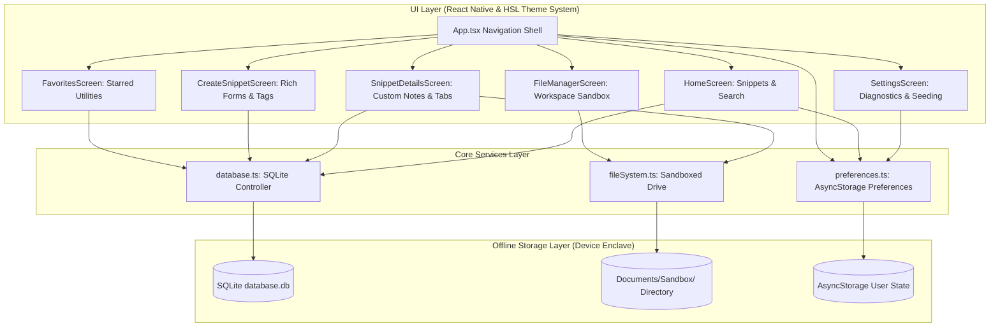

# 📔 DevSnippets Notes

<p align="center">
  
  
  
  
</p>

**DevSnippets Notes** is a premium, offline-first developer notebook and workspace utility application built using **Expo (SDK 55)**, **React Native**, and **TypeScript**. 

Unlike standard notes apps, it is tailor-made for software engineers, allowing them to store, categorize, search, and document code snippets in high-fidelity syntax blocks. Additionally, it integrates a fully-featured **Sandboxed Physical Local Workspace Explorer** that lets you write, edit, and organize actual development files locally on your phone without relying on external servers or active internet connections.

---

## 🛠️ System Architecture

The following diagram illustrates how the components of DevSnippets Notes interact with the offline service drivers and local persistent storage:


---
```
    style App fill:#6366F1,stroke:#fff,stroke-width:2px,color:#fff
    style DB fill:#10B981,stroke:#fff,stroke-width:2px,color:#fff
    style FS_SERV fill:#06B6D4,stroke:#fff,stroke-width:2px,color:#fff
    style PREF fill:#F59E0B,stroke:#fff,stroke-width:2px,color:#fff
    style SQLite fill:#1E293B,stroke:#fff,stroke-width:2px,color:#fff
    style LocalDir fill:#1E293B,stroke:#fff,stroke-width:2px,color:#fff
```

---

## 🚀 Key Features

*   **⚡ Premium Neon Aesthetics & Dual Themes**
    *   *Neon Dark Mode*: A striking `#0B0F19` obsidian background paired with vivid ice-blue and neon primary buttons.
    *   *Slate Light Mode*: A clean, high-contrast `#F8FAFC` bright layout utilizing slate outlines, elegant dynamic typography, and sleek shadows.
*   **💾 Local SQLite SQLite Engine**
    *   Stores title, raw source code, tags, favorite states, screenshot attachments, and detailed markdown descriptions entirely inside an on-device SQLite database container.
*   **📂 Sandboxed Workspace Drive**
    *   A full directory explorer located inside the app's isolated document directory.
    *   Create, view, edit, search, and delete text/code files locally.
    *   Native device Share Sheet integration to export files directly to external editors, emails, or messaging channels.
*   **📝 Description & Usage Notes**
    *   Equipped with dedicated splits: tabbed segments inside snippet views allow developers to swap seamlessly between raw code blocks (with custom themed scrollbars) and markdown explanations.
*   **🛠️ Storage Diagnostics & System Health**
    *   Settings screen showing the active workspace directory, total SQLite record count, total active sandboxed folders, size statistics, and a single-tap **Factory Reset & Seed Data** safety suite.

---

## 📁 Directory Structure

```text
DevSnippets/
├── App.tsx                        # Main coordinator shell, tab router, & splash controller
├── app.json                       # Expo configuration (permissions, splash screens, orientation)
├── package.json                   # Dependency definitions, script tasks, & project metadata
├── tsconfig.json                  # Strict type-checking and compile settings
├── assets/                        # Splash screen graphic assets and app icons
├── src/
│   ├── components/                # Modular UI widgets
│   │   ├── CodeViewer.tsx         # Syntax-themed viewer with Mac-style header layout action window dots
│   │   └── SnippetCard.tsx        # Card wrapper featuring language identifiers & interactive tags
│   ├── screens/                   # High-fidelity layout views
│   │   ├── HomeScreen.tsx         # List search controls, tag filter lists, and fast theme toggle
│   │   ├── SnippetDetailsScreen.tsx # Multi-tab detailed view (Code vs Custom notes) with source exports
│   │   ├── CreateSnippetScreen.tsx  # Dynamic form with custom tags, screenshot attachment, and notes
│   │   ├── FavoritesScreen.tsx    # Dedicated bookmark board showcasing saved utility routines
│   │   ├── FileManagerScreen.tsx  # Sandboxed tree browser, directory creator, editor, and Share controller
│   │   └── SettingsScreen.tsx     # Space analysis dashboards, seeding tools, and metadata profiles
│   ├── services/                  # Offline persistence & native adapters
│   │   ├── database.ts            # Local SQLite schemas initialization, migration, and CRUD promises
│   │   ├── fileSystem.ts          # Isolation wrappers for Expo DocumentDirectory IO and Share Sheets
│   │   └── preferences.ts         # User interface light/dark settings saved in AsyncStorage
│   └── styles/                    # Global visual elements definitions
│       └── theme.ts               # Dynamic stylesheets yielding coordinated HSL system palettes
```

---

## 🛠️ Local Setup Instructions

Get the project running on your development machine in just a few simple steps:

### Prerequisites
- **Node.js** (v18.0.0 or higher recommended)
- **npm** (v9.0.0 or higher) or **yarn**
- **Expo Go App** (installed on your physical iOS or Android device for mobile testing)

---

### Step 1: Clone and Enter the Directory
Clone the repository to your local drive and navigate to the project directory:
```bash
git clone <repository-url>
cd DevSnippets
```

---

### Step 2: Install Node Dependencies
Use NPM to fetch and resolve all required project dependencies:
```bash
npm install
```

---

### Step 3: Start the Development Server
Fire up the Expo Metro bundler:
```bash
npx expo start
```
This launches the Metro interactive CLI.

---

### Step 4: Run the Application

#### Option A: Physical iOS or Android Device (Recommended)
1. Ensure your computer and phone are connected to the **same Wi-Fi network**.
2. Open the **Expo Go** app on your phone.
3. Scan the QR code displayed in the terminal:
   - **Android**: Scan inside the Expo Go application QR reader.
   - **iOS**: Scan using the default iOS Camera app, then tap the prompt to open in Expo Go.

#### Option B: Android Emulator
1. Start an Android Virtual Device (AVD) from Android Studio.
2. Once the emulator is fully booted, press **`a`** in your terminal where Expo is running to launch and install the client.

#### Option C: iOS Simulator (Mac Only)
1. Open Xcode on your Mac.
2. In your terminal, press **`i`** to boot the simulator and install DevSnippets Notes automatically.

#### Option D: Web Browser
1. In your terminal, press **`w`** to spin up the web-compatible sandbox interface.

---

## ⚙️ Core Technical Deep-Dive

### 1. SQLite Offline Storage System
All metadata and text parameters reside completely offline in SQLite. On the first startup, the database auto-provisions and prepares tables using `expo-sqlite`:

```typescript
// Initial schema configuration from database.ts
await db.execAsync(`
  CREATE TABLE IF NOT EXISTS snippets (
    id INTEGER PRIMARY KEY AUTOINCREMENT,
    title TEXT NOT NULL,
    code TEXT NOT NULL,
    language TEXT NOT NULL,
    tags TEXT,
    is_favorite INTEGER DEFAULT 0,
    screenshot_path TEXT,
    description TEXT,
    created_at TEXT DEFAULT CURRENT_TIMESTAMP,
    updated_at TEXT DEFAULT CURRENT_TIMESTAMP
  );
`);
```

### 2. Sandbox Drive Files Engine
The application interacts directly with isolated directory namespaces in user space using `expo-file-system`. It manages documents offline and packages them safely:

```typescript
import * as FileSystem from 'expo-file-system';

// Sandboxed workspace root location
export const WORKSPACE_ROOT = `${FileSystem.documentDirectory}sandbox_workspace/`;
```

### 3. Dynamic HSL Dual-Theme Palette
Styling uses a pure React Native stylesheet relying on dynamic color states that update reactively:

```typescript
export const getThemeColors = (isDark: boolean) => ({
  background: isDark ? '#0B0F19' : '#F8FAFC',
  card: isDark ? '#161F30' : '#FFFFFF',
  text: isDark ? '#F3F4F6' : '#1F2937',
  textMuted: isDark ? '#9CA3AF' : '#6B7280',
  primary: isDark ? '#38BDF8' : '#0284C7',
  border: isDark ? '#243249' : '#E5E7EB',
  accent: isDark ? '#F43F5E' : '#E11D48',
  success: isDark ? '#10B981' : '#059669',
});
```

---

## 🔒 Offline Security Compliance

*   **Zero Network Requests**: The app does not transmit your private development routines, notes, or project parameters over the internet.
*   **Credentials Exempt**: There are no remote AI APIs, AWS endpoints, or Google Gemini keys required. Everything compiles and performs locally, providing safe offline security.

---
